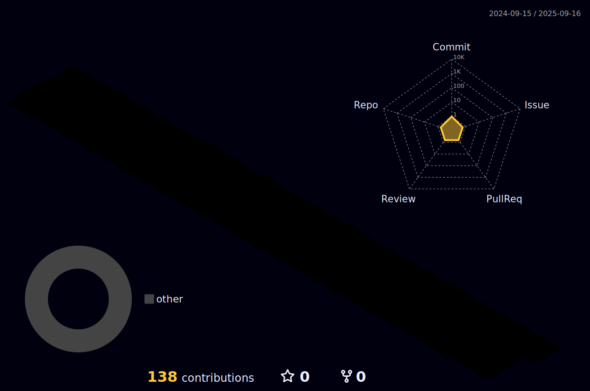

### Olá ! Eu sou o Pablo 👋

-🌱 Estudando JavaScritp/Node.js - Cubos Academy -

-🌱 Estudando JavaScritp/HTML5/CSS3 - Alura/Oracle -

 
  

 
  
  
  
  
  
  

 

  

 

    

  

<h1> </h1>
  

   

 

